# 🛡️ Awesome Threat Hunting Platform

<!-- SEO Meta: threat hunting, SIEM, XDR, MDR, detection engineering, open-source security, cybersecurity tools, managed detection and response, endpoint detection, threat intelligence -->

---

## 📋 Top Threat Hunting Platforms Ecosystem

### 🎯 Curated List of SaaS Products & Open-Source GitHub Projects

*Focused on Proactive Threat Hunting 🔍, Detection Engineering 🛠️, Managed Hunting Services 🏢, XDR/SIEM Analytics 📊 & Adversary Tracking 🕵️*

📅 **Last updated: August 2026**

---

## 📖 About This Repository

This repository tracks notable **SaaS platforms** and **open-source projects** for **Threat Hunting**. These tools and services enable security teams (or managed providers) to proactively search for stealthy adversaries, develop detection content, investigate high-fidelity leads, and reduce dwell time beyond traditional alert-driven SOC operations.

### 🔥 What You'll Find Here

- **16 SaaS Products** — CrowdStrike, Microsoft, Google, Elastic, SentinelOne, and more
- **17+ Open-Source Projects** — Wazuh, CyberChef, osquery, Sigma, MISP, and more
- **Specific Pricing** — Exact starting tier prices, not vague "contact sales"
- **Free Tier Details** — Trial durations, limits, and forever-free plan specifics
- **Company Size Data** — Market cap, valuation, and revenue for every SaaS vendor

---

## 🗂️ Table of Contents

- [🛡️ SaaS/Hosted Platforms](#-saashosted-platforms)
- [💻 Open-Source GitHub Projects](#-open-source-github-projects)
- [➕ Additional Strong Open-Source Options](#-additional-strong-open-source-options)
- [🔧 How to Contribute](#-how-to-contribute)
- [⚠️ Disclaimer](#️-disclaimer)

---

## 🛡️ SaaS/Hosted Platforms

| Product | Company Size | Starting Price | Free Tier | Description |
|---------|-------------|----------------|-----------|-------------|
| [**Microsoft Defender Experts**](https://www.microsoft.com/security) | **Microsoft** — $3.4T market cap (FY2026 revenue $245B) | **$21/user/month** (Defender Experts Suite) | 90-day free trial for Defender for Endpoint P2; E5 Security add-on included in M365 E5 | Managed hunting and expert services layered on Microsoft Defender XDR and Sentinel for organizations in the Microsoft ecosystem. |
| [**Google SecOps (Chronicle)**](https://cloud.google.com/security/products/secops) | **Google Cloud** — $2.0T market cap (Cloud revenue $58.7B in 2025) | **~$2,000/TB/year** ingestion (Standard package) | Free up to **10 GB/day** ingestion via Data Benefit Program; 90-day GCP free trial ($300 credits) | Google's security operations platform offering high-speed search, detection, and hunting across large volumes of security telemetry. |
| [**CrowdStrike Falcon OverWatch**](https://www.crowdstrike.com/) | **CrowdStrike** — $218B market cap ($5.4B FY2026 revenue) | **$59.99/device/year** (Falcon Go) to $184.99/device/year (Falcon Elite) | **15-day free trial** (Falcon Prevent NGAV, up to 100 endpoints) | Elite 24/7 managed threat hunting service that operates on Falcon telemetry to uncover human-operated and stealthy attacks missed by automated detections. |
| [**Arctic Wolf**](https://arcticwolf.com/) | **Arctic Wolf** — $4.3B valuation ($500M+ ARR) | **$8–$25/endpoint/month** (MDR); Silver $16/mo, Gold $18.17/mo, Platinum $21.42/mo; annual minimums from ~$25K–$50K | **90-day free trial** for Managed Security Awareness Plus (30–250 users); core MDR has no free trial — demo on request | Managed detection and response / security operations platform delivering continuous monitoring and hunting as a service. |
| [**Elastic Security**](https://www.elastic.co/security) | **Elastic NV** — ~$14B market cap ($1.36B FY2026 revenue) | **~$99/month** (Standard cloud); Basic tier is **free & open-source** (self-managed) | **Free Basic tier** (self-managed, forever); **14-day cloud trial** (8GB RAM, 240GB storage) | Powerful SIEM and security analytics platform (open-source core available) with strong query languages (KQL/EQL), detection engine, and timeline investigation features ideal for hunting. |
| [**SentinelOne Deep Visibility / Vigilance / WatchTower**](https://www.sentinelone.com/) | **SentinelOne** — $7.7B market cap ($1.1B FY2026 revenue) | **$69.99/endpoint/year** (Core) to $229.99/endpoint/year (Commercial) | **14-day trial** (on request via demo); 14-day standard data retention on paid plans | Deep endpoint and XDR visibility combined with managed threat hunting and MDR services on the Singularity platform. |
| [**Cybereason**](https://www.cybereason.com/) | **Cybereason** (LevelBlue) — $2.5B valuation (~$120M revenue) | **~$45–$60/endpoint/year** (EDR); XDR $58–$72/endpoint/year; MDR adds $18–$32/endpoint/year | **Demo available on request** (no self-serve free trial); requires sales engagement for POV | Defense platform with hunting and investigation features focused on detecting and disrupting advanced attacks. |
| [**LogRhythm**](https://logrhythm.com/) | **Exabeam (merged with LogRhythm)** — ~$250M combined revenue | **~$65/MPS/year** (DetectX analytics); small deployments from **~$33K/year** (500 MPS ≈ 5-7 GB/day) | **5-day free trial** of LogRhythm Axon cloud SIEM (120 hours, up to 500 MPS); self-hosted LogRhythm requires POV on request | SIEM and security operations platform with analytics and hunting capabilities for mid-to-large organizations. |
| [**Devo Security**](https://www.devo.com/) | **Devo Technology** — $2B valuation (~$122M revenue) | **~$320K/year** for 1,000 GB/day ingestion (~$0.88/GB/day); 400-day hot retention included | **15-day free trial** via CrowdStrike Marketplace integration; standalone Devo trial available on request (limited period, restricted access) | Cloud-native security analytics platform supporting real-time and historical hunting across diverse data sources. |
| [**Exabeam**](https://www.exabeam.com/) | **Exabeam** (Thoma Bravo) — $2.4B valuation (acquired, ~$250M revenue) | **~$250/user/year** (per-user analytics model); Fusion SIEM entry from **~$75K/year** | **Free POV** (proof of value) on request; no self-serve free tier; LogRhythm Axon cloud has 5-day trial | Security analytics and SIEM platform known for behavioral analytics, timelines, and support for detection and hunting workflows. |
| [**Huntress**](https://www.huntress.com/) | **Huntress** — $1.5B valuation (~$70M ARR, 543% 3-year growth) | **$8.99/endpoint/month** (Managed EDR, 50-unit minimum); ITDR $4.80/identity/mo, SIEM $4.00/data-source/mo, SAT $2.08/learner/mo | **Free trial** (sign up at huntress.com/start-trial); no credit card required; full platform access during trial | Managed security platform popular with MSPs and mid-market organizations, combining EDR with human threat hunting and response. |
| [**Red Canary**](https://www.redcanary.com/) | **Red Canary** (acquired by Zscaler, 2025) — ~$100M ARR | **$39/endpoint/month** (Active Remediation flat rate); MDR pricing from **~$104/user/month** | **Free trial** (no credit card required); full MDR evaluation during trial period | Managed detection and response provider with strong threat hunting and detection engineering capabilities across multiple EDR backends. |
| [**Uptycs**](https://www.uptycs.com/) | **Uptycs** — ~$105M estimated revenue | **$3/endpoint/month** (Discover tier) | **35-day free trial** (synthetic data environment, no credit card required) | Unified CNAPP and security analytics platform with strong osquery-based telemetry useful for hunting across endpoints and cloud. |
| [**Hunters**](https://www.hunters.security/) | **Hunters** — $118M total funding (~$51M estimated revenue) | **~$250K/year** per platform unit (12-month contract via AWS Marketplace); covers ingestion, detection, triage & investigation | **30-day POV** (proof of value) available on request; no self-serve free tier | Data-agnostic threat hunting and detection platform that sits on top of existing data lakes/SIEMs, emphasizing detection-as-code and high-fidelity hunting workflows. |
| [**Intezer**](https://www.intezer.com/) | **Intezer** — $83M valuation (~$5.3M revenue, 54.9% YoY growth) | **$2,400/year** (Malware Analysis, 100 scans/month); AI SOC: custom endpoint-based pricing | **Free community tier** — 10 file scans/month with restricted access to advanced features | Genetic malware analysis and threat detection platform that aids hunting and investigation of code reuse and advanced threats. |
| [**Mandiant Managed Defense**](https://www.mandiant.com/) | **Google Cloud / Mandiant** — $5.4B acquisition (Google Cloud $58.7B revenue) | **~$83K/year** average (range $80K–$200K/year depending on scope and modules) | **$300 GCP free trial** credits (90 days) applicable to Google SecOps; Mandiant Advantage Threat Intelligence starts at ~$40K/year with no free tier | Elite managed threat hunting and detection service from Mandiant (Google Cloud), leveraging frontline intelligence and expertise. |

> 📝 **Notes on company size**: Public companies show market cap; private companies show last known valuation. Revenue figures are annual estimates from public filings, press releases, or third-party estimates (Growjo, Tracxn, PitchBook). Pricing reflects published list rates as of mid-2026; enterprise customers may negotiate lower rates.

---

## 💻 Open-Source GitHub Projects

| Repository | ⭐ Github_Stars | Description |
|------------|---------|-------------|
| [**CyberChef**](https://github.com/gchq/CyberChef) |  | The Cyber Swiss Army Knife — a web app for encryption, encoding, compression, and data analysis. Widely used in threat hunting for decoding payloads, analyzing malware artifacts, and transforming threat intelligence data. |
| [**osquery**](https://github.com/osquery/osquery) |  | SQL-powered operating system instrumentation and analytics framework. Enables threat hunters to query endpoint state across Windows, macOS, and Linux using familiar SQL syntax. |
| [**Wazuh**](https://github.com/wazuh/wazuh) |  | Leading open-source XDR/SIEM platform with log analysis, file integrity monitoring, vulnerability detection, and extensible rules — widely used as a foundation for threat hunting. |
| [**CrowdSec**](https://github.com/crowdsecurity/crowdsec) |  | Open-source, collaborative security engine that detects malicious behavior and shares signals across a community blocklist. Useful as a complementary detection and hunting data source. |
| [**Atomic Red Team**](https://github.com/redcanaryco/atomic-red-team) |  | Small, highly portable detection tests mapped to the MITRE ATT&CK framework. Enables threat hunters to validate detection coverage and test hunting hypotheses with real adversary techniques. |
| [**SigmaHQ / Sigma Rules**](https://github.com/SigmaHQ/sigma) |  | Generic open signature format and large community repository of 3,000+ detection rules that can be converted to many SIEM/query languages for hunting and detection engineering. |
| [**MISP**](https://github.com/MISP/MISP) |  | Open-source Threat Intelligence Platform for sharing, storing, and correlating Indicators of Compromise (IoCs) and threat intelligence. Feeds hunting hypotheses with structured intelligence. |
| [**Velociraptor**](https://github.com/velocidex/velociraptor) |  | Advanced open-source endpoint monitoring, digital forensic, and incident response (DFIR) platform using VQL (Velociraptor Query Language) for real-time threat hunting at scale. |
| [**Zeek**](https://github.com/zeek/zeek) |  | The world's leading open-source network security monitor. Zeek transforms network traffic into structured logs for protocol analysis, anomaly detection, and network-based threat hunting. |
| [**ntopng**](https://github.com/ntop/ntopng) |  | High-speed web-based network traffic analysis and exploration tool. Provides deep visibility into network flows, protocol distribution, and top talkers for network threat hunting. |
| [**Suricata**](https://github.com/OISF/suricata) |  | High-performance Network IDS, IPS, and network security monitoring engine. Generates rich logs (EVE JSON) for protocol analysis, intrusion detection, and threat hunting workflows. |
| [**Security Onion**](https://github.com/Security-Onion-Solutions/securityonion) |  | Free and open Linux distribution purpose-built for threat hunting, network security monitoring, and log management. Includes Suricata, Zeek, Elastic, Kibana, CyberChef, and case management. |
| [**Fleet**](https://github.com/fleetdm/fleet) |  | Open-source osquery manager for device management, MDM, and security monitoring at scale. Provides centralized control over osquery deployments for endpoint visibility and hunting queries. |
| [**TheHive**](https://github.com/TheHive-Project/TheHive) |  | Open-source Security Incident Response Platform (SIRP) for collaborative case management, observable enrichment, and investigation orchestration during hunts. |
| [**OpenCTI**](https://github.com/OpenCTI-Platform/opencti) |  | Open-source cyber threat intelligence platform for structuring, storing, and visualizing threat knowledge that feeds hunting hypotheses. Integrates with MISP, STIX/TAXII, and custom feeds. |
| [**HEARTH (THOR Collective)**](https://github.com/THORCollective/HEARTH) |  | Community-driven library of threat hunting hypotheses and methodologies organized around structured frameworks. Provides actionable hunting playbooks for SOC teams. |
| [**Senrigan**](https://github.com/Yamato-Security/senrigan) |  | Offline open-source platform focused on AWS CloudTrail DFIR and threat hunting with built-in hunts and dashboards for cloud environment investigation. |

---

### ➕ Additional Strong Open-Source Options

- 🔍 **Elastic Security (ELK Stack)** — Open-source search and analytics stack that powers many hunting environments; supports powerful queries, detection rules, timelines, and machine-learning jobs.
- 🌐 **Zeek / Suricata + Arkime (formerly Moloch)** for deep network hunting and full-packet capture analysis.
- 🧠 **MISP Warning Lists & Galaxy** for enriching threat intelligence during hunts.
- 📓 Custom **Jupyter / notebook-based** hunting environments on top of data lakes.
- ⚙️ Detection-as-code repositories and CI pipelines for testing hunting content.
- 🔄 **Sigma CLI** and **Uncoder.IO** for converting Sigma rules to platform-specific queries.

---

## 🏗️ Frameworks for Building Custom Systems

> 💡 Combine **Wazuh** or **Elastic Security** (or **Security Onion**) as the core data and detection platform, ingest endpoint/network/cloud telemetry, apply **Sigma** rules and custom hunting queries, enrich with **OpenCTI**/**MISP** intelligence, and manage investigations in **TheHive** or a similar open case system. Add hypothesis libraries from **HEARTH** and schedule recurring hunts. This stack provides a complete, self-hosted threat hunting capability with full data ownership and no per-endpoint hunting license fees, though it requires skilled analysts and ongoing detection engineering effort.

---

## 🔧 How to Contribute

1. 🍴 Fork the repo.
2. ✏️ Add/edit entries in `README.md` (follow existing format).
3. 📋 Include: name, link, 1–2 sentence description, and whether it's SaaS or open-source.
4. 📨 Submit PR with a short explanation.

⭐ Star the repo if you find it useful!

---

## ⚠️ Disclaimer

- 📌 This is a **community-curated** list — not exhaustive and not an endorsement.
- 🔐 Threat hunting involves sensitive security data and high-stakes decisions. Open-source platforms offer excellent transparency and cost control but still require proper architecture, tuning, threat intelligence, and skilled operators to be effective. Managed hunting services add human expertise that pure tooling cannot fully replace.
- ✅ Always validate detections and hunting results in context before taking response actions.

---

## 📈 Star History

---

**🛡️ Made for threat hunters, detection engineers, and SOC teams building proactive defense capabilities.**

Let's make threat hunting more accessible, collaborative, and grounded in open tools and shared knowledge. 🚀

<!-- SEO Keywords: threat hunting platform, SIEM tools, XDR solution, MDR provider, detection engineering, open-source security, cybersecurity tools, endpoint detection and response, network security monitoring, threat intelligence platform, MITRE ATT&CK, Sigma rules, Wazuh, Elastic Security, CrowdStrike, Microsoft Defender, Google SecOps -->
